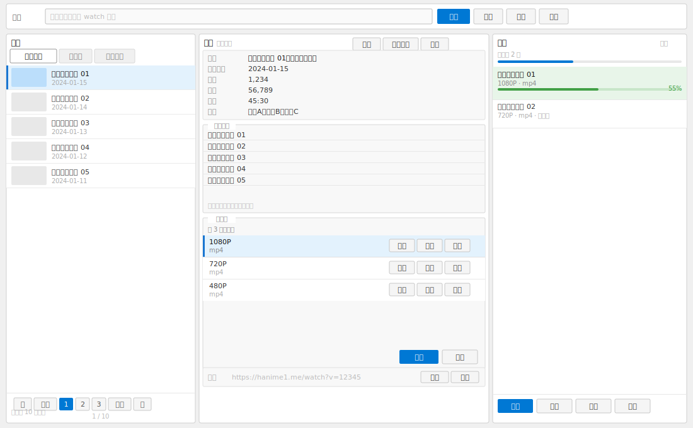

<p align="center">
  
</p>

<div align="center">


<br><br>


<br>


</div>

---

## 社区交流

> QQ 反馈群：**1102413927** — 使用问题、功能建议、闲聊均可

---

## 界面预览

<table align="center">
  <tr>
    <td align="center" width="33%">
      
      <sub>主界面 · 浅色模式</sub>
    </td>
    <td align="center" width="33%">
      
      <sub>主界面 · 深色模式</sub>
    </td>
    <td align="center" width="33%">
      
      <sub>精简模式</sub>
    </td>
  </tr>
</table>

---

## 模拟体验

> 界面交互示意，展示主要操作流程（SVG 动画，无需安装）。

<p align="center">
  
</p>

---

## 功能特性

**搜索与浏览**

- 视频搜索，支持关键词与 ID 直达
- 高级筛选：标签、日期、时长、排序、广泛配对
- 详情面板：简介、标签、相关视频推荐、封面预览

**下载与队列**

- 自动解析多清晰度视频源（1080P / 720P / 480P 等）
- 下载队列：并发下载、暂停 / 恢复、失败自动重试
- 下载历史记录，避免重复下载
- 失败后可手动触发重新解析视频源

**收藏与数据**

- 多收藏夹管理：新建、重命名、删除、导入 / 导出
- 所有数据保存在程序目录，便携无需安装

**个性化**

- 浅色 / 深色主题切换
- 精简模式，隐藏详情面板
- 详情面板显示项自由开关
- 内置视频播放器
- Cloudflare 会话复用，减少重复验证
- 列表封面缩略图缓存

---

## 运行要求

| 环境 | 要求 |
|:---|:---|
| 开发运行 | Windows、[.NET 9 SDK](https://dotnet.microsoft.com/download)、WebView2 Runtime |
| 发布版运行 | Windows（x64 / x86 / arm64）、[.NET 9 Desktop Runtime](https://dotnet.microsoft.com/download/dotnet/9.0)、WebView2 Runtime |

> WebView2 Runtime 通常已预装于 Windows 11，若缺失可[点此下载](https://developer.microsoft.com/microsoft-edge/webview2/)。

---

## 构建与发布

```bash
# 构建
dotnet build "Hanime1Downloader.CSharp.csproj"

# 运行
dotnet run --project "Hanime1Downloader.CSharp.csproj"

# 发布（单文件、非自包含、win-x64）
dotnet publish "Hanime1Downloader.CSharp.csproj" -c Release -p:DebugType=None -p:DebugSymbols=false
```

发布输出：`bin/Release/net9.0-windows/win-x64/publish/`

---

## 数据文件

所有数据均存储在程序同目录下，拷贝文件夹即可完整迁移。

| 文件 | 说明 |
|:---|:---|
| `settings.json` | 程序设置 |
| `favorites.json` | 收藏夹数据 |
| `download_history.json` | 下载历史 |
| `download_queue.json` | 下载队列（可配置是否保留） |
| `cookies.json` | Cloudflare 会话缓存 |

---

## 项目结构

```
Hanime1Downloader.CSharp/
├── MainWindow.xaml(.cs)       主界面与核心交互逻辑
├── Views/                     子窗口：设置、筛选、验证、播放器等
├── Services/                  业务服务：HTTP、下载、主题、缩略图缓存等
├── Models/                    数据模型：设置、视频信息、下载项等
├── Assets/                    静态资源（筛选项数据、图标）
├── Themes/                    浅色 / 深色主题 XAML 资源
└── Converters/                XAML 绑定值转换器
```

---

## 许可证

本项目遵循 [MIT License](https://github.com/yxxawa/hanime1DownLoader/blob/main/LICENSE) 开源协议。

欢迎 Star、Fork 与 PR。

<p align="center">
  
</p>
